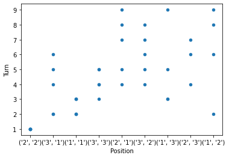
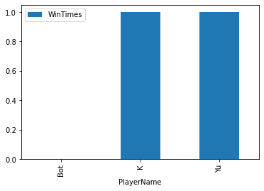
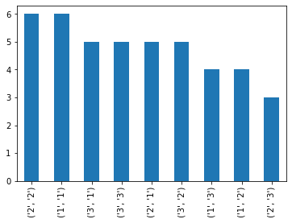

```python
import pandas as pd
games_filename = "/Users/yunhan/week5/tictactoe/game_record.csv"
move_filename = "/Users/yunhan/week5/tictactoe/move_record.csv"
result_filename = "/Users/yunhan/week5/tictactoe/result.csv"
```


```python
games = pd.read_csv(games_filename)
moves = pd.read_csv(move_filename)
result = pd.read_csv(result_filename)
```


    pandas.core.frame.DataFrame


```python
moves.plot.scatter(y = "Turn",x = "Position")
```


    <AxesSubplot:xlabel='Position', ylabel='Turn'>


    

    


```python
result.plot.bar(x = "PlayerName",y = "WinTimes")
```


    <AxesSubplot:xlabel='PlayerName'>


    

    


```python
moves["Position"].value_counts().plot.bar()
```


    <AxesSubplot:>


    

    

